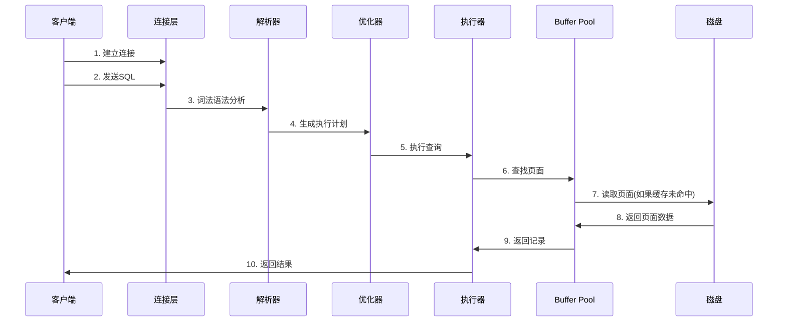
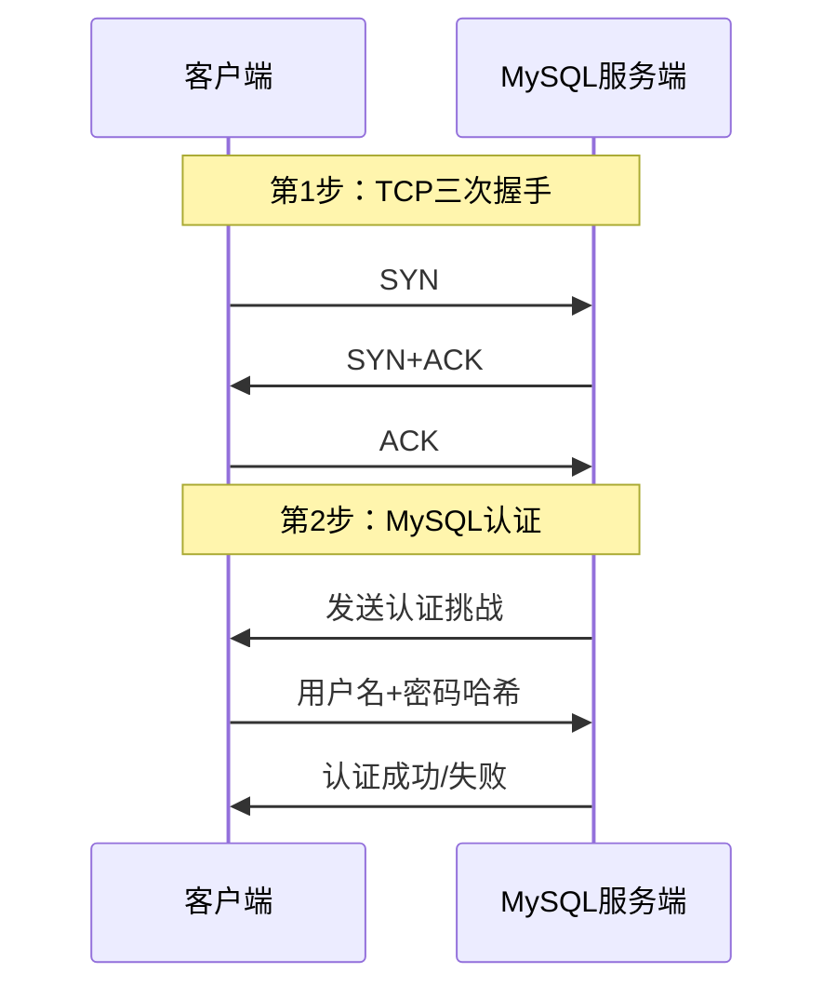
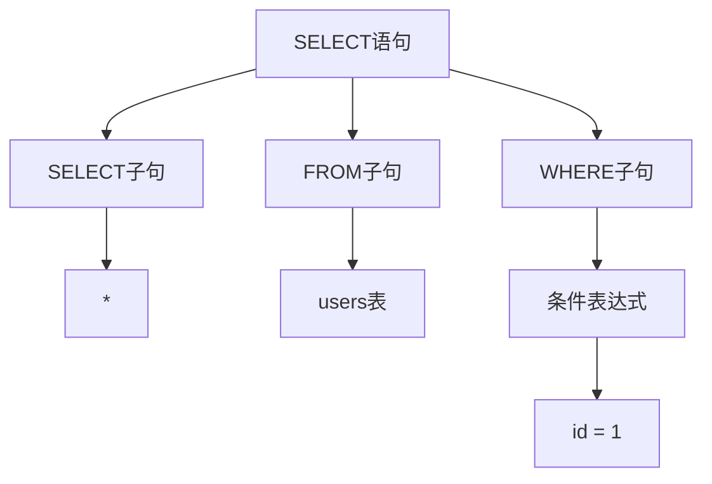
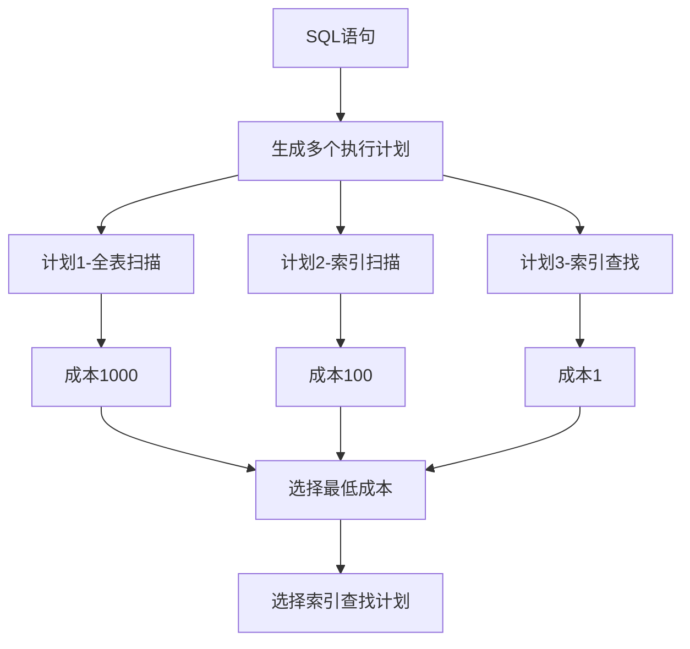
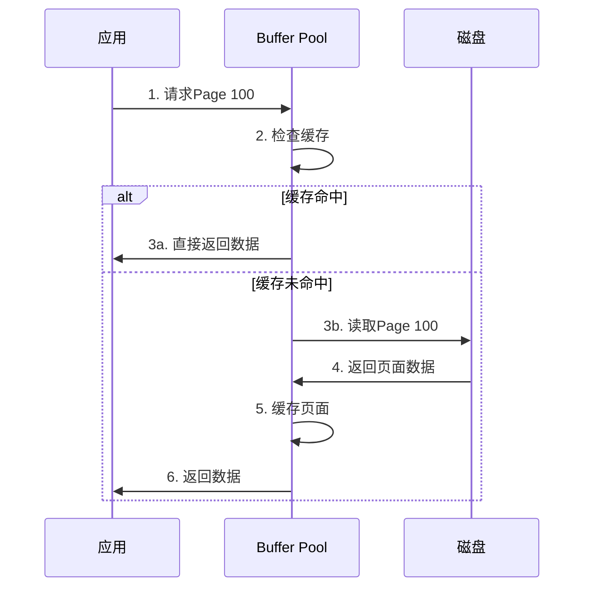
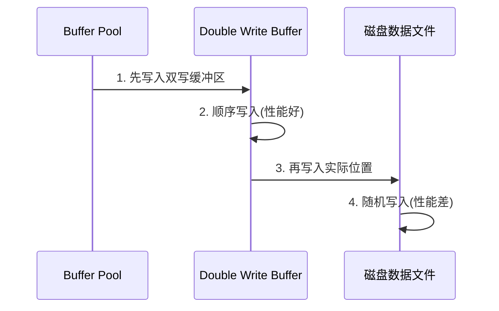
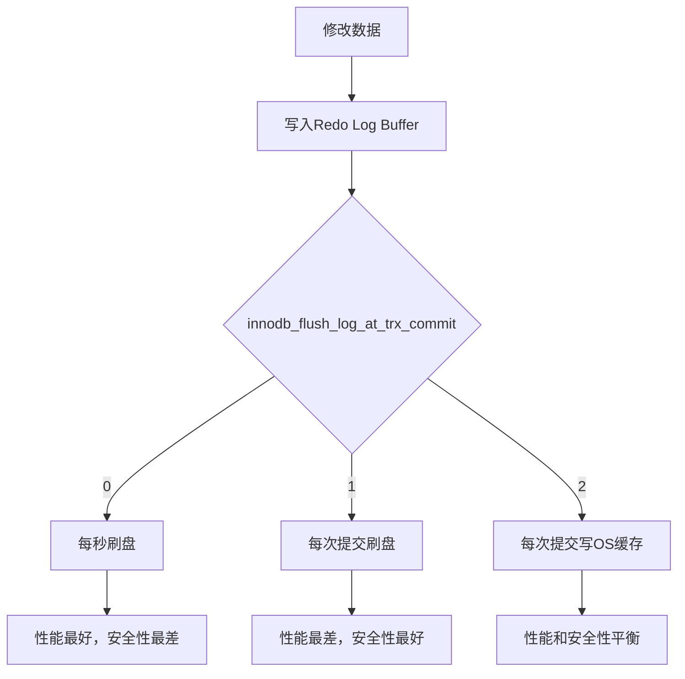
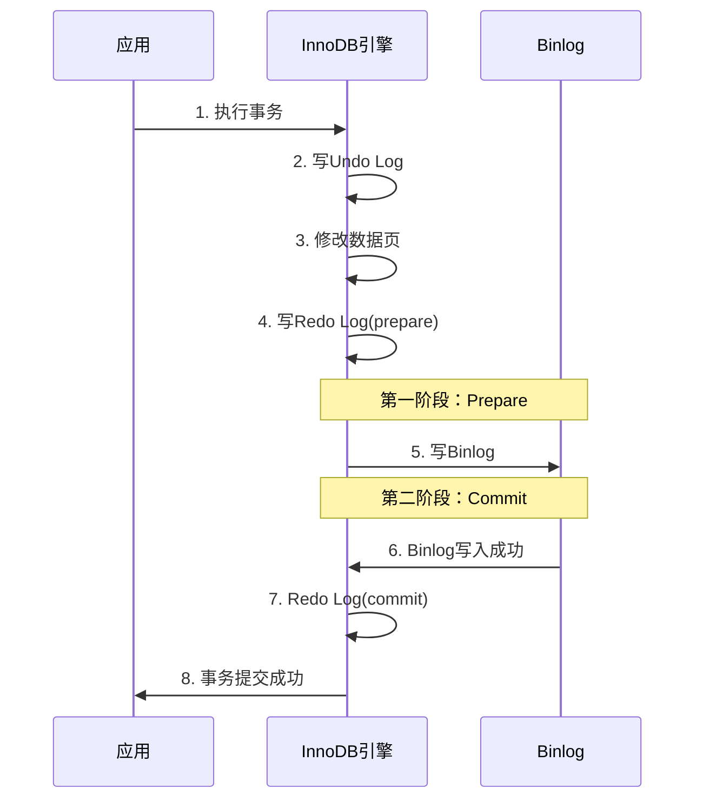

# 第一章：MySQL架构与执行流程 - 一条SQL的完整旅程

## 🎯 学习目标

通过跟踪一条SQL语句的完整执行过程，深入理解：
1. 客户端与服务端的通信机制
2. SQL解析与优化的核心原理
3. Page页面的存储结构与数据组织
4. Buffer Pool的工作机制与性能优化
5. 事务日志系统的协同工作
6. 两阶段提交保证数据一致性

---

## 第一部分：一条SQL的执行之旅

### 1.1 整体流程概览

让我们跟踪这条SQL的完整执行过程：
```sql
SELECT * FROM users WHERE id = 1;
```



---

## 第二部分：客户端与服务端通信过程

### 2.1 连接建立过程

**动画演示1：TCP连接建立**


### 2.2 半双工通信特性

```sql
-- 演示连接管理
SHOW PROCESSLIST;
SHOW STATUS LIKE 'Connections';
SHOW STATUS LIKE 'Threads_connected';
```

**关键概念**：
- MySQL使用半双工通信（某一时刻只能单向传输）
- 长连接 vs 短连接的性能差异
- 连接池的重要性

---

## 第三部分：SQL解析过程

### 3.1 词法分析

**动画演示2：词法分析过程**
```
原始SQL: SELECT * FROM users WHERE id = 1;

第1步：识别关键字 → [SELECT] [FROM] [WHERE]
第2步：识别标识符 → [users] [id]  
第3步：识别操作符 → [*] [=]
第4步：识别常量   → [1]
第5步：识别分隔符 → [;]
```

### 3.2 语法分析

**动画演示3：语法树构建**


### 3.3 语义分析

```sql
-- 演示语义检查
EXPLAIN SELECT * FROM users WHERE id = 1;
```

**检查内容**：
- 表是否存在
- 列是否存在
- 权限是否足够
- 数据类型是否匹配

---

## 第四部分：优化器工作原理

### 4.1 基于成本的优化

**动画演示4：优化器决策过程**


### 4.2 执行计划分析

```sql
-- 查看执行计划
EXPLAIN FORMAT=JSON SELECT * FROM users WHERE id = 1;

-- 查看优化器成本
SHOW STATUS LIKE 'Last_query_cost';
```

---

## 第五部分：Page页面存储结构

### 5.1 Page的基本概念

**Page是MySQL存储的基本单位**：
- 默认大小：16KB
- 包含多条记录
- 通过双向链表连接

### 5.2 Page内部结构

**动画演示5：Page结构展示**
```
Page Header (38字节)
├── Page类型
├── 记录数量  
├── 空闲空间指针
└── 页面校验和

User Records (用户记录区)
├── Record 1: id=1, name='张三'
├── Record 2: id=2, name='李四'  
└── Record 3: id=3, name='王五'

Free Space (空闲空间)

Page Directory (页目录)
└── 记录偏移量数组

Page Trailer (8字节)
└── 校验和
```

### 5.3 记录在Page中的存储

**动画演示6：记录存储过程**
```
第1步：id=1的记录存储
┌─────────────────────────────┐
│ Record Header | id=1 | name='张三' │
└─────────────────────────────┘

第2步：id=2的记录存储  
┌─────────────────────────────┐
│ Record Header | id=1 | name='张三' │
│ Record Header | id=2 | name='李四' │  
└─────────────────────────────┘

第3步：双向链表连接
Record1 ←→ Record2 ←→ Record3
```

### 5.4 数据查找过程

```sql
-- 演示页面查找
SELECT * FROM users WHERE id = 1;
```

**动画演示7：页面内查找过程**
```
第1步：定位到目标Page
第2步：在Page Directory中二分查找
第3步：找到记录所在的槽位
第4步：在槽位内线性查找
第5步：返回匹配记录
```

---

## 第六部分：磁盘寻址与Buffer Pool

### 6.1 磁盘寻址的性能问题

**磁盘寻址过程**：
1. 寻道时间（移动磁头）
2. 旋转延迟（等待扇区）
3. 传输时间（读取数据）

**问题**：机械硬盘随机I/O性能差（~100 IOPS）

### 6.2 Buffer Pool解决方案

**动画演示8：Buffer Pool工作原理**


### 6.3 Buffer Pool内部结构

```sql
-- 查看Buffer Pool配置
SHOW VARIABLES LIKE 'innodb_buffer_pool_size';
SHOW STATUS LIKE 'Innodb_buffer_pool%';
```

**核心组件**：
- **Free List**：空闲页面链表
- **LRU List**：最近最少使用链表  
- **Flush List**：脏页链表

---

## 第七部分：Buffer Pool的LRU管理

### 7.1 改进的LRU算法

**动画演示9：LRU链表管理**
```
初始状态：
Young区(5/8) ────── Old区(3/8)
[Page1][Page2][Page3][Page4][Page5] ── [Page6][Page7][Page8]

新页面加入：
第1步：新Page9加入Old区头部
第2步：如果Page9被频繁访问，移入Young区
第3步：Young区满时，末尾页面移入Old区
```

### 7.2 预读机制

```sql
-- 查看预读配置
SHOW VARIABLES LIKE 'innodb_read_ahead%';
```

**两种预读**：
- **线性预读**：顺序访问触发
- **随机预读**：随机访问触发

---

## 第八部分：脏页刷新与双写缓冲

### 8.1 脏页产生过程

**动画演示10：脏页产生**
```
第1步：执行UPDATE语句
第2步：修改Buffer Pool中的页面
第3步：页面标记为"脏页"
第4步：加入Flush List
第5步：等待刷新到磁盘
```

### 8.2 双写缓冲(Double Write Buffer)

**动画演示11：双写过程**


**为什么需要双写**：
- 防止页面写入过程中的部分写失效
- 保证数据页的完整性

```sql
-- 查看双写配置
SHOW VARIABLES LIKE 'innodb_doublewrite';
```

---

## 第九部分：事务日志系统

### 9.1 Undo Log - 回滚日志

**动画演示12：Undo Log工作过程**
```
第1步：事务开始
第2步：记录修改前的数据到Undo Log
第3步：执行实际修改
第4步：如果回滚，使用Undo Log恢复
第5步：如果提交，标记Undo Log可清理
```

```sql
-- 演示事务回滚
BEGIN;
UPDATE users SET name = '新名字' WHERE id = 1;
-- 此时Undo Log记录了原始值
ROLLBACK; -- 使用Undo Log恢复
```

### 9.2 Redo Log - 重做日志

**动画演示13：Redo Log刷盘策略**


```sql
-- 查看Redo Log配置
SHOW VARIABLES LIKE 'innodb_log%';
SHOW VARIABLES LIKE 'innodb_flush_log_at_trx_commit';
```

---

## 第十部分：Binlog与两阶段提交

### 10.1 Binlog的作用

```sql
-- 查看Binlog配置
SHOW VARIABLES LIKE 'log_bin';
SHOW VARIABLES LIKE 'binlog_format';
```

**三种格式**：
- **Statement**：记录SQL语句
- **Row**：记录行变化
- **Mixed**：混合模式

### 10.2 两阶段提交过程

**动画演示14：两阶段提交完整流程**


---

## 第十一部分：完整实践演示

### 11.1 环境准备

```sql
-- 创建演示表
CREATE TABLE users (
    id INT PRIMARY KEY AUTO_INCREMENT,
    name VARCHAR(50),
    age INT,
    INDEX idx_age (age)
) ENGINE=InnoDB;

-- 插入测试数据
INSERT INTO users (name, age) VALUES 
('张三', 25), ('李四', 30), ('王五', 28);
```

### 11.2 跟踪SQL执行过程

```sql
-- 开启性能监控
SET GLOBAL general_log = 'ON';
SET GLOBAL slow_query_log = 'ON';

-- 执行目标SQL
SELECT * FROM users WHERE id = 1;

-- 查看执行统计
SHOW STATUS LIKE 'Innodb_buffer_pool%';
SHOW STATUS LIKE 'Innodb_data%';
```

### 11.3 Buffer Pool状态监控

```sql
-- 创建监控视图
CREATE VIEW buffer_pool_status AS
SELECT 
    'Buffer Pool Size' as metric,
    @@innodb_buffer_pool_size / 1024 / 1024 as value_mb
UNION ALL
SELECT 
    'Buffer Pool Hit Rate',
    (1 - (SELECT VARIABLE_VALUE FROM INFORMATION_SCHEMA.GLOBAL_STATUS WHERE VARIABLE_NAME = 'Innodb_buffer_pool_reads') / 
     (SELECT VARIABLE_VALUE FROM INFORMATION_SCHEMA.GLOBAL_STATUS WHERE VARIABLE_NAME = 'Innodb_buffer_pool_read_requests')) * 100;

-- 查看状态
SELECT * FROM buffer_pool_status;
```

---

## 📚 总结与要点

### 核心流程回顾

1. **连接建立** → TCP三次握手 + MySQL认证
2. **SQL解析** → 词法分析 → 语法分析 → 语义分析  
3. **查询优化** → 基于成本选择最优执行计划
4. **页面查找** → Buffer Pool缓存 → 磁盘读取
5. **数据修改** → Undo Log → 修改页面 → 标记脏页
6. **事务提交** → Redo Log → Binlog → 两阶段提交
7. **后台刷新** → 脏页刷盘 → 双写保护

### 性能优化要点

- **连接管理**：使用连接池，避免频繁建连
- **SQL优化**：合理使用索引，避免全表扫描
- **Buffer Pool**：配置足够大小，监控命中率
- **日志配置**：根据业务需求平衡性能和安全性

### 下节预告

**第二章：MySQL索引原理与优化**
- B+树索引结构深度解析
- 索引设计最佳实践
- 查询优化实战技巧

---

## 📖 参考资料

1. [MySQL官方文档 - InnoDB存储引擎](https://dev.mysql.com/doc/refman/8.0/en/innodb-storage-engine.html)
2. [MySQL官方文档 - 查询优化](https://dev.mysql.com/doc/refman/8.0/en/optimization.html)
3. [高性能MySQL（第3版）](https://book.douban.com/subject/23008813/)

