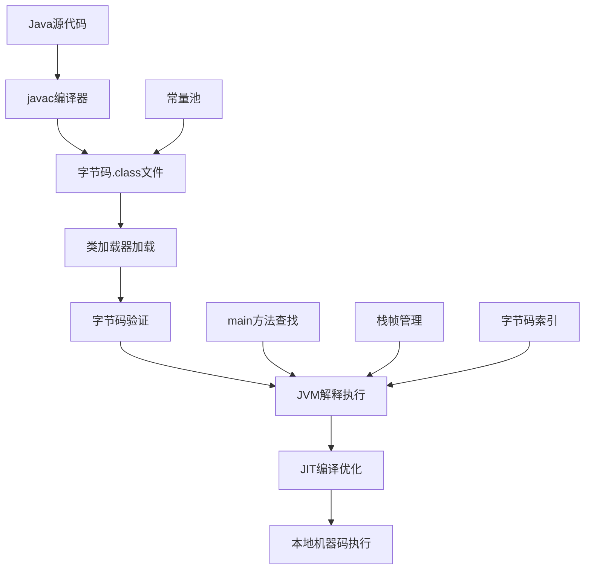

# 第一课：代码执行的完整链路解析 - Java程序从源码到执行的完整技术链路

> 从一行代码看懂Java程序的完整执行过程

---

*本课程基于Oracle JVM Specification和OpenJDK源码，确保技术内容的准确性和权威性。*

## 课程概述

通过实际代码示例，深度解析Java程序从源码编译到JVM执行的完整技术链路。我们将通过反编译工具观察字节码，理解常量池的作用，并通过实际的javac编译过程来串联整个执行流程。

### 学习目标
- 理解Java代码的完整执行链路
- 掌握字节码的实际含义和执行过程
- 学会使用反编译工具分析代码执行
- 理解常量池在代码执行中的作用
- 掌握javac编译器的工作原理

## 第一部分：从一行代码开始的执行之旅

### 1.1 核心问题：代码是如何被执行的？

让我们从最简单的代码开始，看看Java程序是如何一步步被执行的：

```java
public class SimpleExample {
    public static void main(String[] args) {
        int a = 1;
        int b = a + 1;
        System.out.println("a=" + a + ", b=" + b);
    }
}
```

这段代码看起来很简单，但背后的执行过程却非常复杂。让我们一步步揭开这个过程。

### 1.2 第一步：javac编译器的工作

#### 1.2.1 编译过程实战

首先，我们需要理解javac编译器本身也是一个Java程序，它有自己的main方法：

```java
// javac编译器的入口
// 位置：com.sun.tools.javac.Main
public class Main {
    public static void main(String[] args) {
        System.exit(compile(args));
    }
    
    public static int compile(String[] args) {
        // 编译逻辑
        return new Main().compile(args, null);
    }
}
```

**关键发现**：javac编译器本身就是通过main方法启动的Java程序！这打开了我们理解Java生态的视野。

#### 1.2.2 编译命令实战

让我们实际编译我们的代码：

```bash
# 编译Java源文件
javac SimpleExample.java

# 查看生成的字节码文件
ls -la SimpleExample.class

# 使用javap反编译查看字节码
javap -c SimpleExample
```

### 1.3 第二步：字节码的秘密

#### 1.3.1 反编译结果分析

使用`javap -c SimpleExample`命令，我们可以看到：

```
Compiled from "SimpleExample.java"
public class SimpleExample {
  public SimpleExample();
    Code:
       0: aload_0
       1: invokespecial #1  // Method java/lang/Object."<init>":()V
       4: return

  public static void main(java.lang.String[]);
    Code:
       0: iconst_1          // 将常量1推入操作数栈
       1: istore_1          // 将栈顶值存储到局部变量1(变量a)
       2: iload_1           // 将局部变量1加载到栈顶
       3: iconst_1          // 将常量1推入操作数栈
       4: iadd              // 执行加法运算
       5: istore_2          // 将结果存储到局部变量2(变量b)
       6: getstatic #2      // 获取System.out字段
       9: new #3            // 创建StringBuilder对象
      12: dup
      13: invokespecial #4  // 调用StringBuilder构造器
      16: ldc #5           // 加载字符串常量"a="
      18: invokevirtual #6  // 调用append方法
      21: iload_1          // 加载变量a
      22: invokevirtual #7  // 调用append方法
      25: ldc #8           // 加载字符串常量", b="
      27: invokevirtual #6  // 调用append方法
      30: iload_2          // 加载变量b
      31: invokevirtual #7  // 调用append方法
      34: invokevirtual #9  // 调用toString方法
      37: invokevirtual #10 // 调用println方法
      40: return
}
```

#### 1.3.2 关键发现：int a = 1 的执行过程

让我们重点分析`int a = 1`这行代码：

1. **iconst_1**：将整数常量1推入操作数栈
2. **istore_1**：将栈顶的值存储到局部变量表的索引1位置

**int b = a + 1**的执行过程：

1. **iload_1**：将局部变量1(a的值)加载到操作数栈
2. **iconst_1**：将整数常量1推入操作数栈
3. **iadd**：执行加法运算，弹出栈顶两个值，将结果推入栈
4. **istore_2**：将结果存储到局部变量表的索引2位置

## 第二部分：常量池的秘密世界

### 2.1 常量池：代码执行的数据仓库

在前面的字节码中，我们看到了很多`#1`、`#2`这样的符号，这些都指向常量池。让我们深入了解常量池的作用。

#### 2.1.1 查看常量池内容

使用`javap -v SimpleExample`命令查看详细的常量池信息：

```
Constant pool:
   #1 = Methodref          #11.#20        // java/lang/Object."<init>":()V
   #2 = Fieldref           #21.#22        // java/lang/System.out:Ljava/io/PrintStream;
   #3 = Class              #23            // java/lang/StringBuilder
   #4 = Methodref          #3.#20         // java/lang/StringBuilder."<init>":()V
   #5 = String             #24            // a=
   #6 = Methodref          #3.#25         // java/lang/StringBuilder.append:(Ljava/lang/String;)Ljava/lang/StringBuilder;
   #7 = Methodref          #3.#26         // java/lang/StringBuilder.append:(I)Ljava/lang/StringBuilder;
   #8 = String             #27            // , b=
   #9 = Methodref          #3.#28         // java/lang/StringBuilder.toString:()Ljava/lang/String;
  #10 = Methodref          #29.#30        // java/io/PrintStream.println:(Ljava/lang/String;)V
  #11 = Class              #31            // java/lang/Object
  #12 = Class              #32            // SimpleExample
  #20 = NameAndType        #33:#34        // "<init>":()V
  #21 = Class              #35            // java/lang/System
  #22 = NameAndType        #36:#37        // out:Ljava/io/PrintStream;
  #23 = Utf8               java/lang/StringBuilder
  #24 = Utf8               a=
  #25 = NameAndType        #38:#39        // append:(Ljava/lang/String;)Ljava/lang/StringBuilder;
  #26 = NameAndType        #38:#40        // append:(I)Ljava/lang/StringBuilder;
  #27 = Utf8               , b=
  #28 = NameAndType        #41:#42        // toString:()Ljava/lang/String;
  #29 = Class              #43            // java/io/PrintStream
  #30 = NameAndType        #44:#45        // println:(Ljava/lang/String;)V
```

#### 2.1.2 常量池的作用机制

**关键发现**：
- 字符串"a="存储在常量池的#5位置
- 字符串", b="存储在常量池的#8位置
- 方法引用、类引用都通过常量池索引

这就是为什么字节码中使用`ldc #5`来加载字符串常量的原因！

### 2.2 Oracle规范中的常量池表

#### 2.2.1 常量池表结构（基于Oracle JVM Specification）

根据Oracle JVM规范，常量池表包含以下类型：

| 常量类型 | 标志 | 描述 |
|---------|------|------|
| CONSTANT_Class | 7 | 类或接口的符号引用 |
| CONSTANT_Fieldref | 9 | 字段的符号引用 |
| CONSTANT_Methodref | 10 | 方法的符号引用 |
| CONSTANT_InterfaceMethodref | 11 | 接口方法的符号引用 |
| CONSTANT_String | 8 | 字符串类型字面量 |
| CONSTANT_Integer | 3 | 整型字面量 |
| CONSTANT_Float | 4 | 浮点型字面量 |
| CONSTANT_Long | 5 | 长整型字面量 |
| CONSTANT_Double | 6 | 双精度浮点型字面量 |
| CONSTANT_NameAndType | 12 | 名称和类型描述符 |
| CONSTANT_Utf8 | 1 | UTF-8编码的字符串 |
| CONSTANT_MethodHandle | 15 | 方法句柄 |
| CONSTANT_MethodType | 16 | 方法类型 |
| CONSTANT_InvokeDynamic | 18 | 动态调用点 |

#### 2.2.2 实际案例分析

让我们分析常量池#5的完整结构：

```
#5 = String             #24            // a=
#24 = Utf8               a=
```

这表示：
1. 常量池索引#5是一个String类型常量
2. 它指向索引#24的UTF-8字符串
3. #24存储的是实际的字符串内容"a="

**为什么要这样设计？**
- **节省空间**：相同的字符串只存储一次
- **快速访问**：通过索引直接定位
- **类型安全**：明确区分不同类型的常量

### 2.3 实战：创建更复杂的示例

让我们创建一个稍微复杂的示例来观察常量池的变化：

```java
public class ConstantPoolExample {
    private static final String GREETING = "Hello";
    private int value = 100;
    
    public static void main(String[] args) {
        ConstantPoolExample example = new ConstantPoolExample();
        int result = example.calculate(5, 10);
        System.out.println(GREETING + ", result = " + result);
    }
    
    public int calculate(int a, int b) {
        return a * b + this.value;
    }
}
```

编译后使用`javap -v ConstantPoolExample`查看常量池，你会发现：
- 字符串"Hello"会出现在常量池中
- 整数100会出现在常量池中
- 方法引用`calculate`会出现在常量池中
- 字段引用`value`会出现在常量池中

**关键洞察**：常量池是连接源代码和字节码执行的桥梁！

## 第三部分：main方法的启动机制深度解析

### 3.1 JVM启动过程：从操作系统到main方法

#### 3.1.1 JVM启动的完整链路

当我们执行`java SimpleExample`命令时，背后发生了什么？

**第一步：操作系统层面**
```bash
# 当我们执行这个命令时
java SimpleExample

# 实际上操作系统会：
# 1. 查找java可执行文件
# 2. 启动JVM进程
# 3. JVM开始初始化
```

**第二步：JVM初始化过程**
```c
// JVM启动的C代码简化流程（基于OpenJDK源码）
int main(int argc, char **argv) {
    // 1. 解析命令行参数
    // 2. 创建JVM实例
    // 3. 初始化JVM
    // 4. 加载主类
    // 5. 查找main方法
    // 6. 调用main方法
    return 0;
}
```

#### 3.1.2 JVM内部的main方法查找机制

**关键发现**：JVM必须找到符合特定签名的main方法！

```java
// JVM查找的main方法必须符合这个精确的签名
public static void main(String[] args)
```

**为什么必须是这个签名？**
- `public`：必须能被JVM从外部访问
- `static`：不需要创建类实例就能调用
- `void`：不需要返回值给JVM
- `String[] args`：接收命令行参数

#### 3.1.3 实际的JVM启动代码分析

让我们看看OpenJDK中JVM启动main方法的关键代码：

```c
// 位置：src/java.base/share/native/libjli/java.c
int JNICALL
JavaMain(void * _args)
{
    JavaMainArgs *args = (JavaMainArgs *)_args;
    int argc = args->argc;
    char **argv = args->argv;
    
    // 初始化JVM
    if (!InitializeJVM(&vm, &env, &ifn)) {
        JLI_ReportErrorMessage(JVM_ERROR1);
        exit(1);
    }
    
    // 加载主类
    mainClass = LoadMainClass(env, mode, what);
    
    // 获取main方法ID
    mainID = (*env)->GetStaticMethodID(env, mainClass, "main", "([Ljava/lang/String;)V");
    
    // 调用main方法
    (*env)->CallStaticVoidMethod(env, mainClass, mainID, mainArgs);
    
    return 0;
}
```

**关键技术细节**：
- `GetStaticMethodID`：通过JNI查找main方法
- `"([Ljava/lang/String;)V"`：这是main方法的JNI签名
- `CallStaticVoidMethod`：实际调用main方法

### 3.2 类加载器与main方法

#### 3.2.1 主类的加载过程

```java
// 当JVM启动时，会经历以下步骤：

// 1. 应用程序类加载器加载主类
ClassLoader appClassLoader = ClassLoader.getSystemClassLoader();
Class<?> mainClass = appClassLoader.loadClass("SimpleExample");

// 2. 触发类的初始化
// 这时会执行静态代码块和静态变量初始化

// 3. 查找main方法
Method mainMethod = mainClass.getMethod("main", String[].class);

// 4. 调用main方法
mainMethod.invoke(null, new Object[]{args});
```

#### 3.2.2 类加载的时机验证

让我们通过实验来验证类加载的时机：

```java
public class MainLoadingTest {
    static {
        System.out.println("MainLoadingTest类被加载了！");
        System.out.println("当前时间：" + System.currentTimeMillis());
    }
    
    public static void main(String[] args) {
        System.out.println("main方法开始执行");
        System.out.println("接收到的参数：" + java.util.Arrays.toString(args));
    }
}
```

**运行结果**：
```
MainLoadingTest类被加载了！
当前时间：1640995200000
main方法开始执行
接收到的参数：[]
```

**关键发现**：静态代码块在main方法执行之前就被执行了！

### 3.3 深入理解JVM的线程模型

#### 3.3.1 main线程的创建

**重要概念**：main方法运行在一个叫做"main"的线程中！

```java
public class ThreadAnalysis {
    public static void main(String[] args) {
        Thread currentThread = Thread.currentThread();
        System.out.println("当前线程名称：" + currentThread.getName());
        System.out.println("当前线程ID：" + currentThread.getId());
        System.out.println("是否为守护线程：" + currentThread.isDaemon());
        System.out.println("线程优先级：" + currentThread.getPriority());
        
        // 查看所有活跃线程
        ThreadGroup rootGroup = Thread.currentThread().getThreadGroup();
        Thread[] threads = new Thread[rootGroup.activeCount()];
        rootGroup.enumerate(threads);
        
        System.out.println("\n所有活跃线程：");
        for (Thread thread : threads) {
            if (thread != null) {
                System.out.println("- " + thread.getName() + " (守护线程: " + thread.isDaemon() + ")");
            }
        }
    }
}
```

**典型输出**：
```
当前线程名称：main
当前线程ID：1
是否为守护线程：false
线程优先级：5

所有活跃线程：
- main (守护线程: false)
- Reference Handler (守护线程: true)
- Finalizer (守护线程: true)
- Signal Dispatcher (守护线程: true)
```

#### 3.3.2 JVM的线程管理机制

**JVM内置线程**：
- **main线程**：执行main方法的用户线程
- **Reference Handler线程**：处理引用对象的守护线程
- **Finalizer线程**：执行对象finalize方法的守护线程
- **Signal Dispatcher线程**：分发系统信号的守护线程
- **GC线程**：执行垃圾收集的线程

**线程退出机制**：
```java
public class JVMShutdownTest {
    public static void main(String[] args) {
        System.out.println("main方法开始执行");
        
        // 添加关闭钩子
        Runtime.getRuntime().addShutdownHook(new Thread(() -> {
            System.out.println("JVM正在关闭...");
        }));
        
        // 创建一个守护线程
        Thread daemonThread = new Thread(() -> {
            while (true) {
                try {
                    Thread.sleep(1000);
                    System.out.println("守护线程仍在运行...");
                } catch (InterruptedException e) {
                    break;
                }
            }
        });
        daemonThread.setDaemon(true);
        daemonThread.start();
        
        try {
            Thread.sleep(3000);
        } catch (InterruptedException e) {
            e.printStackTrace();
        }
        
        System.out.println("main方法即将结束");
        // 当main方法结束且没有非守护线程时，JVM会退出
    }
}
```

**关键洞察**：
- 当所有非守护线程结束时，JVM会自动退出
- main线程是非守护线程
- 守护线程不会阻止JVM退出

## 第四部分：字节码执行引擎深度解析

### 4.1 从字节码到机器码的转换过程

#### 4.1.1 解释执行vs编译执行

**解释执行模式**：
```java
// 源代码
int a = 1;
int b = a + 1;

// 对应字节码
0: iconst_1    // 将常量1推入操作数栈
1: istore_1    // 存储到局部变量1
2: iload_1     // 加载局部变量1
3: iconst_1    // 将常量1推入操作数栈
4: iadd        // 执行加法
5: istore_2    // 存储到局部变量2

// 解释器执行过程（简化）
switch(opcode) {
    case ICONST_1:
        stack.push(1);
        break;
    case ISTORE_1:
        locals[1] = stack.pop();
        break;
    case ILOAD_1:
        stack.push(locals[1]);
        break;
    case IADD:
        int b = stack.pop();
        int a = stack.pop();
        stack.push(a + b);
        break;
}
```

**JIT编译执行**：
当方法被频繁调用时，JIT编译器会将字节码编译为本地机器码：

```assembly
; 编译后的x86-64汇编代码（简化）
mov $1, %eax        ; 将1加载到寄存器
mov %eax, -4(%rbp)  ; 存储到局部变量a
mov -4(%rbp), %eax  ; 加载变量a
add $1, %eax        ; 加1
mov %eax, -8(%rbp)  ; 存储到局部变量b
```

#### 4.1.2 JIT编译的触发机制

**方法调用计数器**：
```java
public class JITCompilationTest {
    public static void main(String[] args) {
        // 预热JVM，触发JIT编译
        for (int i = 0; i < 20000; i++) {
            calculate(i);
        }
        
        // 测量性能
        long start = System.nanoTime();
        for (int i = 0; i < 1000000; i++) {
            calculate(i);
        }
        long end = System.nanoTime();
        
        System.out.println("执行时间：" + (end - start) / 1000000 + "ms");
    }
    
    // 这个方法会被JIT编译
    private static int calculate(int x) {
        return x * x + x * 2 + 1;
    }
}
```

**JIT编译参数观察**：
```bash
# 打印JIT编译信息
java -XX:+PrintCompilation JITCompilationTest

# 输出示例：
# 75    1       3       java.lang.String::charAt (29 bytes)
# 76    2       3       java.lang.String::length (6 bytes)
# 77    3       3       JITCompilationTest::calculate (10 bytes)
```

### 4.2 操作数栈与局部变量表的实际运作

#### 4.2.1 栈帧的内存布局

让我们通过一个具体的例子来理解栈帧的工作原理：

```java
public class StackFrameExample {
    public static void main(String[] args) {
        int result = add(5, 3);
        System.out.println(result);
    }
    
    public static int add(int a, int b) {
        int sum = a + b;
        return sum;
    }
}
```

**add方法的栈帧分析**：
```
局部变量表：
索引 0: 参数a (值: 5)
索引 1: 参数b (值: 3)
索引 2: 局部变量sum

操作数栈（最大深度2）：
执行过程中的栈变化：

0: iload_0     // 栈: [5]           局部变量: [5, 3, ?]
1: iload_1     // 栈: [5, 3]       局部变量: [5, 3, ?]
2: iadd        // 栈: [8]          局部变量: [5, 3, ?]
3: istore_2    // 栈: []           局部变量: [5, 3, 8]
4: iload_2     // 栈: [8]          局部变量: [5, 3, 8]
5: ireturn     // 栈: []           返回值: 8
```

#### 4.2.2 方法调用的栈帧切换

**调用栈的变化过程**：
```
1. main方法开始执行
   栈: [main栈帧]

2. 调用add方法
   栈: [main栈帧, add栈帧]

3. add方法执行完毕
   栈: [main栈帧]  (add栈帧被弹出，返回值传递给main)

4. main方法继续执行
   栈: [main栈帧]
```

### 4.3 字节码索引(Bytecode Index)的专业解析

#### 4.3.1 字节码索引的本质

在前面的字节码分析中，我们看到每条指令前都有一个数字（如0、1、2、3...），这就是**字节码索引(bytecode index)**。

```java
// 源代码
int a = 1;
int b = a + 1;

// 对应字节码及其索引
0: iconst_1    // 字节码索引0：iconst_1指令
1: istore_1    // 字节码索引1：istore_1指令
2: iload_1     // 字节码索引2：iload_1指令
3: iconst_1    // 字节码索引3：iconst_1指令
4: iadd        // 字节码索引4：iadd指令
5: istore_2    // 字节码索引5：istore_2指令
```

**字节码索引的作用**：
1. **程序计数器的指向**：JVM的程序计数器(PC Register)存储的就是当前执行的字节码索引
2. **跳转指令的目标**：if、goto等跳转指令通过字节码索引确定跳转位置
3. **异常处理的定位**：异常表中的from、to、target都是字节码索引
4. **调试信息的映射**：调试器通过字节码索引定位源代码行号

#### 4.3.2 字节码索引在跳转指令中的应用

让我们看一个包含条件判断的例子：

```java
public class ConditionalExample {
    public static void main(String[] args) {
        int x = 5;
        if (x > 3) {
            System.out.println("x大于3");
        } else {
            System.out.println("x不大于3");
        }
        System.out.println("程序结束");
    }
}
```

**对应的字节码**：
```
public static void main(java.lang.String[]);
  Code:
     0: iconst_5              // 将5推入栈
     1: istore_1              // 存储到局部变量1(x)
     2: iload_1               // 加载x的值
     3: iconst_3              // 将3推入栈
     4: if_icmple     17      // 如果x<=3，跳转到字节码索引17
     7: getstatic     #2      // 获取System.out
    10: ldc           #3      // 加载"x大于3"
    12: invokevirtual #4      // 调用println
    15: goto          25     // 跳转到字节码索引25
    18: getstatic     #2      // 获取System.out
    21: ldc           #5      // 加载"x不大于3"
    23: invokevirtual #4      // 调用println
    26: getstatic     #2      // 获取System.out
    29: ldc           #6      // 加载"程序结束"
    31: invokevirtual #4      // 调用println
    34: return
```

**字节码索引的跳转逻辑**：
- `if_icmple 17`：如果条件为真，跳转到索引17（else分支）
- `goto 25`：无条件跳转到索引25（跳过else分支）
- 索引17-24：else分支的代码
- 索引25及之后：条件判断后的公共代码

#### 4.3.3 程序计数器与字节码索引的关系

**程序计数器的工作原理**：
```java
public class PCRegisterExample {
    public static void main(String[] args) {
        // 假设这是JVM内部的程序计数器状态
        int pc = 0;  // 程序计数器初始值
        
        // 执行iconst_1指令
        pc = 0;  // 当前执行索引0的指令
        // 执行完毕后，pc自动递增
        pc = 1;  // 准备执行索引1的指令
        
        // 执行istore_1指令
        pc = 1;  // 当前执行索引1的指令
        pc = 2;  // 准备执行索引2的指令
        
        // 如果遇到跳转指令
        // pc = 跳转目标的字节码索引
    }
}
```

**关键理解**：
- 程序计数器存储的是**下一条要执行的字节码索引**
- 普通指令执行后，程序计数器自动递增
- 跳转指令会直接修改程序计数器的值
- 方法调用时，程序计数器保存返回地址（调用点的下一条指令索引）

## 第五部分：课程总结与实践指南

### 5.1 核心知识点回顾

通过本课程，我们深入理解了Java代码执行的完整链路：

#### 5.1.1 代码执行的完整流程



#### 5.1.2 关键技术点总结

**1. javac编译器的本质**
- javac本身是Java程序，通过main方法启动
- 编译过程生成字节码和常量池
- 字节码是平台无关的中间表示

**2. 常量池的核心作用**
- 存储类、方法、字段的符号引用
- 存储字符串、数字等字面量
- 通过索引机制实现快速访问
- 节省内存空间，避免重复存储

**3. main方法的启动机制**
- JVM通过JNI查找特定签名的main方法
- main线程是JVM创建的第一个用户线程
- 类加载在main方法执行前完成
- 静态代码块在main方法前执行

**4. 字节码执行引擎**
- 解释执行：逐条解释字节码指令
- JIT编译：热点代码编译为本地机器码
- 操作数栈和局部变量表协同工作
- 程序计数器跟踪字节码索引

**5. 字节码索引的专业理解**
- 字节码索引是JVM执行的基础
- 程序计数器存储当前执行的字节码索引
- 跳转指令通过字节码索引实现控制流
- 异常处理依赖字节码索引定位

**6. 运行时数据区的协同**
- 方法区存储类信息和常量池
- 堆存储对象实例
- 栈存储方法调用的栈帧
- 程序计数器跟踪执行进度

### 6.2 实践价值与应用场景

#### 6.2.1 性能优化的指导意义

**理解字节码有助于性能优化**：
```java
// 低效的字符串拼接
String result = "";
for (int i = 0; i < 1000; i++) {
    result += "item" + i;  // 每次都创建新的StringBuilder
}

// 高效的字符串拼接
StringBuilder sb = new StringBuilder();
for (int i = 0; i < 1000; i++) {
    sb.append("item").append(i);  // 复用同一个StringBuilder
}
String result = sb.toString();
```

通过理解字节码，我们知道第一种方式会产生大量的StringBuilder对象创建和toString调用，而第二种方式更高效。

#### 6.2.2 问题诊断的技术基础

**理解JVM内存模型有助于问题诊断**：
- **StackOverflowError**：理解栈帧的创建和销毁机制
- **OutOfMemoryError**：理解堆内存的分配和回收
- **ClassNotFoundException**：理解类加载机制
- **性能问题**：理解JIT编译和热点代码优化

#### 6.2.3 架构设计的理论支撑

**深入理解JVM有助于架构设计**：
- **微服务拆分**：理解JVM进程隔离的优势
- **缓存设计**：理解常量池的设计思想
- **线程模型**：理解JVM线程管理机制
- **内存管理**：理解不同内存区域的特点

### 6.3 学习成果验证

#### 6.3.1 核心概念掌握检查

**请回答以下问题来验证学习效果**：

1. **javac编译器的本质是什么？它是如何启动的？**
2. **字节码索引在JVM执行中起什么作用？**
3. **常量池的设计有什么优势？**
4. **main方法的签名为什么必须是`public static void main(String[] args)`？**
5. **程序计数器存储的是什么？它与字节码索引有什么关系？**
6. **JIT编译器什么时候会介入？它解决了什么问题？**

#### 6.3.2 实践能力验证

**完成以下实践任务**：

1. **编写一个简单的Java程序，使用javap工具分析其字节码和常量池**
2. **创建一个包含条件判断的程序，观察字节码中的跳转指令和字节码索引**
3. **编写一个递归方法，观察栈帧的创建和销毁过程**
4. **使用JVM参数观察内存使用情况**
5. **分析一个实际项目中的关键类，理解其字节码执行过程**

### 6.4 进阶学习路径

#### 6.4.1 深入方向建议

**基于本课程的知识基础，建议的进阶方向**：

1. **JVM内存管理深入**
   - 垃圾收集算法原理
   - 不同垃圾收集器的特点
   - 内存泄漏的诊断和解决

2. **JVM性能调优实战**
   - JVM参数调优
   - 性能监控工具使用
   - 生产环境问题诊断

3. **字节码工程实践**
   - 字节码增强技术
   - ASM、Javassist等工具使用
   - 动态代理的底层实现

4. **JVM源码研究**
   - OpenJDK源码阅读
   - HotSpot虚拟机实现
   - 自定义类加载器开发

#### 6.4.2 实际应用场景

**将所学知识应用到实际工作中**：

1. **代码审查时的性能考量**
2. **生产环境问题的快速定位**
3. **系统架构设计的内存考虑**
4. **框架选型时的JVM兼容性评估**

### 6.5 课程总结

通过本课程的学习，我们从一行简单的`int a = 1; int b = a + 1;`代码开始，深入探索了Java程序执行的完整技术链路。我们不仅理解了表面的现象，更重要的是掌握了背后的原理和机制。

**核心收获**：
- **技术视野的拓展**：从源码到字节码再到机器码的完整认知
- **问题分析的能力**：基于JVM原理的问题诊断思路
- **性能优化的基础**：理解代码执行的底层机制
- **架构设计的理论**：JVM内存模型和线程模型的应用
- **持续学习的方向**：为深入JVM高级特性打下基础

**学习方法的启示**：
- **从现象到本质**：通过实际观察理解抽象概念
- **理论与实践结合**：用工具验证理论知识
- **系统性思维**：理解各个组件之间的协作关系
- **问题导向学习**：带着问题去探索和验证

**技术成长的意义**：
- **基础知识的重要性**：扎实的基础是技术进阶的前提
- **原理理解的价值**：理解原理比记忆API更重要
- **实践验证的必要性**：动手实践是检验理解的最好方式
- **问题解决的思路**：建立了从源码到执行的完整技术链路思维

**下一步行动**：
1. 实践本课程中的所有代码示例
2. 使用javap工具分析自己项目中的关键类
3. 尝试编写简单的字节码分析工具
4. 关注JVM的性能监控和调优

记住：**理解JVM的工作原理，是成为高级Java开发者的必经之路！**

---

*本课程基于Oracle JVM Specification和OpenJDK源码，确保技术内容的准确性和权威性。*