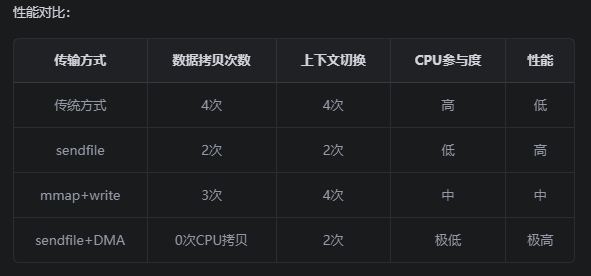

# 第1天：Kafka基础概念和消息队列原理

## 学习目标
- 理解Kafka的核心概念和应用场景
- 掌握Topic、Partition、Broker等基本组件
- 深入理解Kafka的零拷贝技术原理
- 了解Kafka在现代架构中的重要作用

## 1. 什么是事件流（Event Streaming）？

### 一句话定义
**事件流就是将现实世界中发生的各种事情（事件）实时记录下来，并按时间顺序连续不断地传递和处理的技术。**

简单理解：
- 就像生活中的"流水账"，记录每一件发生的事情
- 但这个"流水账"是实时的、连续的、可以被多个系统同时读取和处理的
- 比如：用户点击、订单创建、支付完成、库存变化等，都是"事件"

### 技术定义
事件流（Event Streaming）是一种数据处理范式，它将数据视为连续不断的事件序列，实时捕获、存储、处理和响应这些事件。

### 1.1 生动比喻：人体神经系统

事件流就像人体的**中枢神经系统**，让我们用一个生动的例子来理解：

**场景：看见地上掉落的钱**
```
👁️ 眼睛【捕获】→ 🧠 大脑【处理】→ 🦵 右脚【响应】
   事件感知      事件存储处理     事件响应
```

**完整的事件流过程：**
1. **事件捕获**：眼睛看见"地上有钱"这个事件
2. **事件传输**：通过神经信号将事件信息传递给大脑
3. **事件存储**：大脑瞬间存储并分析这个事件
4. **事件处理**：大脑做出决策"应该捡起来"
5. **事件响应**：发送神经信号控制右脚踩住钱，然后弯腰捡起

### 1.2 技术层面的事件流

<mcreference link="https://kafka.apache.org/documentation/" index="0">0</mcreference>事件流技术相当于数字化的中枢神经系统，它是构建"永不停机"世界的技术基石——在这个世界中，企业日益由软件定义和自动化驱动，而软件的使用者更往往是其他软件。

从技术层面看，事件流技术是指：从事件源（数据库、传感器、移动设备、云服务和软件应用等）实时捕获事件流数据；持久化存储事件流以供后续检索；对事件流进行实时或追溯性的操作处理与响应；并根据需要将事件流路由至不同的目标技术系统。通过确保数据的持续流动和及时解读，事件流技术使正确信息能在恰当时机精准送达所需之处。

**对应人体神经系统：**
- **事件源** = 眼耳口鼻等感官器官
- **事件传输** = 神经信号传递
- **事件存储处理** = 大脑的记忆和分析
- **事件响应** = 控制身体器官做出反应

### 1.3 事件流的应用场景

<mcreference link="https://kafka.apache.org/documentation/" index="0">0</mcreference>事件流应用于各行各业和组织的各种用例，每个都可以用人体神经系统来类比。其众多示例包括：

- **实时处理支付和金融交易**，如证券交易所、银行和保险公司（就像大脑瞬间决定是否购买股票）
- **实时跟踪和监控汽车、卡车、车队和货物**，如物流和汽车行业（就像眼睛持续观察环境变化，追踪移动物体）
- **持续捕获和分析来自IoT设备或其他设备的传感器数据**，如工厂和风力发电场（就像皮肤感受温度、湿度变化并传递给大脑）
- **收集并立即响应客户互动和订单**，如零售、酒店和旅游业以及移动应用程序（就像听到有人呼唤你的名字立即转头回应）
- **监控医院护理中的患者并预测病情变化**，以确保在紧急情况下及时治疗（就像身体感觉不适时向大脑发送预警信号）
- **连接、存储和提供公司不同部门产生的数据**（就像神经网络连接全身各个器官）
- **作为数据平台、事件驱动架构和微服务的基础**（就像脊髓是整个神经系统的主干道）

## 2. Apache Kafka®是什么？

<mcreference link="https://kafka.apache.org/documentation/" index="0">0</mcreference>Apache Kafka®是一个事件流平台。这意味着什么？

Kafka结合了三个关键功能，因此您可以通过单一的经过实战检验的解决方案端到端地实现事件流用例：

1. **发布（写入）和订阅（读取）事件流**，包括从其他系统持续导入/导出数据
2. **持久可靠地存储事件流**，想存储多长时间就存储多长时间
3. **在事件发生时或回顾性地处理事件流**

所有这些功能都以分布式、高度可扩展、弹性、容错和安全的方式提供。Kafka可以部署在裸机硬件、虚拟机和容器上，以及本地和云中。您可以选择自行管理Kafka环境或使用各种供应商提供的完全托管服务。

### 2.1 Kafka如何工作？

<mcreference link="https://kafka.apache.org/documentation/" index="0">0</mcreference>Kafka是一个分布式系统，由通过高性能TCP网络协议通信的**服务器**和**客户端**组成。它可以部署在本地以及云环境中的裸机硬件、虚拟机和容器上。

**服务器**：Kafka作为一个或多个服务器的集群运行，可以跨越多个数据中心或云区域。其中一些服务器构成存储层，称为代理（brokers）。其他服务器运行Kafka Connect，以持续导入和导出数据作为事件流，将Kafka与您现有的系统（如关系数据库以及其他Kafka集群）集成。为了让您实现关键任务用例，Kafka集群具有高度可扩展性和容错性：如果其任何服务器发生故障，其他服务器将接管其工作，以确保持续运行而不会丢失任何数据。

**客户端**：它们允许您编写分布式应用程序和微服务，以并行、大规模和容错的方式读取、写入和处理事件流，即使在网络问题或机器故障的情况下也是如此。Kafka附带了一些此类客户端，这些客户端由Kafka社区提供的数十个客户端进行了增强：客户端可用于Java和Scala（包括更高级别的Kafka Streams库）、Go、Python、C/C++以及许多其他编程语言以及REST API。

### 2.2 主要概念和术语

<mcreference link="https://kafka.apache.org/documentation/" index="0">0</mcreference>**事件（Event）**记录了世界或您的业务中"发生了某事"的事实。就像人体神经系统中的"神经信号"，记录了感官捕获到的信息。在文档中也称为记录（record）或消息（message）。当您向Kafka读取或写入数据时，您以事件的形式执行此操作。从概念上讲，事件具有键（key）、值（value）、时间戳（timestamp）和可选的元数据标头（metadata headers）。

**对应"看见地上掉落的钱"的事件示例：**
- 事件键："visual-event-001"
- 事件值："发现地上有100元钱币"
- 事件时间戳："2024年1月15日下午2:06"

**生产者（Producers）**是那些向Kafka发布（写入）事件的客户端应用程序，**消费者（Consumers）**是那些订阅（读取和处理）这些事件的客户端应用程序。在Kafka中，生产者和消费者完全解耦且彼此不可知，这是实现Kafka闻名的高可扩展性的关键设计元素。例如，生产者永远不需要等待消费者。Kafka提供各种保证，例如精确一次处理事件的能力。

**事件被组织并持久存储在主题（Topics）中**。非常简化地说，主题类似于文件系统中的文件夹，事件是该文件夹中的文件。示例主题名称可能是"payments"。Kafka中的主题始终是多生产者和多订阅者的：一个主题可以有零个、一个或多个向其写入事件的生产者，以及零个、一个或多个订阅这些事件的消费者。主题中的事件可以根据需要多次读取——与传统消息系统不同，事件在消费后不会被删除。相反，您可以通过每个主题的配置设置定义Kafka应该保留事件多长时间，之后旧事件将被丢弃。Kafka的性能相对于数据大小实际上是恒定的，因此长时间存储数据是完全可以的。

**事件结构示例（对应"看见地上掉落的钱"）：**
```json
{
  "key": "visual-event-001",
  "value": {
    "event_type": "发现物品",
    "description": "看见地上掉落的钱",
    "location": "人行道上",
    "amount": "100元",
    "action_needed": "捡起来"
  },
  "timestamp": "2024年1月15日下午2:06",
  "headers": {
    "source": "eye-sensor",
    "sensor_type": "visual",
    "priority": "high"
  }
}
```

**对应人体神经系统：**
- **key**: 事件的唯一标识（神经信号的编号）
- **value**: 事件的具体内容（"看见地上有钱"的详细信息）
- **timestamp**: 事件发生的时间（大脑记录的时间戳）
- **headers**: 事件的元数据（来源是眼睛，类型是视觉信号）

## 3. Kafka核心概念深入解析

### 3.1 Topics（主题）和Partitions（分区）

<mcreference link="https://kafka.apache.org/documentation/" index="0">0</mcreference>主题被分区，这意味着主题分布在位于不同Kafka代理上的多个"桶"中。数据的这种分布式放置对于可扩展性非常重要，因为它允许客户端应用程序同时从/向多个代理读取和写入数据。当新事件发布到主题时，它实际上被附加到主题的分区之一。具有相同事件键（例如，客户或车辆ID）的事件被写入同一分区，Kafka保证给定主题分区的任何消费者将始终以与写入事件完全相同的顺序读取该分区的事件。

**主题特性：**
- **多生产者和多消费者**：一个主题可以有零个、一个或多个生产者和消费者
- **事件持久性**：事件在消费后不会被删除，可以多次读取
- **可配置保留**：通过配置设置定义事件保留时间
- **性能恒定**：Kafka的性能相对于数据大小实际上是恒定的

**推荐命名规范：**
- payments             # 支付事件
- user-events          # 用户事件  
- order-notifications  # 订单通知
- inventory-updates    # 库存更新

### 3.2 Partitions（分区）和数据分布

**主题被分区**，这意味着主题分布在位于不同Kafka代理上的多个"桶"中。数据的这种分布式放置对于可扩展性非常重要，因为它允许客户端应用程序同时从/向多个代理读取和写入数据。

**分区机制：**
- 当新事件发布到主题时，它实际上被附加到主题的分区之一
- 具有相同事件键（例如，客户或车辆ID）的事件被写入同一分区
- Kafka保证给定主题分区的任何消费者将始终以与写入事件完全相同的顺序读取该分区的事件

**分区示例：**
```
Topic: user-events (3个分区)
├── Partition-0: [msg1, msg4, msg7, ...] (在Broker-1)
├── Partition-1: [msg2, msg5, msg8, ...] (在Broker-2)
└── Partition-2: [msg3, msg6, msg9, ...] (在Broker-3)
```

**分区的优势：**
- **并行处理**：多个分区可以同时处理消息
- **水平扩展**：增加分区数量提高吞吐量
- **负载分散**：分区分布在不同Broker上
- **顺序保证**：单分区内消息严格有序

### 3.3 Brokers（代理服务器）和集群架构

简单理解：
用人体神经系统比喻：Brokers就像 大脑的存储区域 ，负责：

- 接收和存储来自各个"神经末梢"（生产者）的信息
- 将存储的信息提供给需要的"器官"（消费者）
- 即使某个存储区域出现问题，其他区域也能继续工作，保证整个系统正常运行
一句话总结 ：Brokers是Kafka集群中负责存储事件数据的服务器，通过分布式架构实现高可用性和容错性。

**Kafka作为分布式系统运行**，由通过高性能TCP网络协议通信的服务器和客户端组成。它可以部署在裸机硬件、虚拟机和容器上，既可以在本地环境也可以在云环境中。

**服务器端：**
- **存储层（Brokers）**：Kafka作为一个或多个服务器的集群运行，这些服务器可以跨越多个数据中心或云区域。其中一些服务器构成存储层，称为代理（brokers）
- **Kafka Connect服务器**：其他服务器运行Kafka Connect，持续导入和导出数据作为事件流，以将Kafka与现有系统（如关系数据库以及其他Kafka集群）集成
- **高可用性**：为了实现关键任务用例，Kafka集群具有高度可扩展性和容错性：如果任何服务器发生故障，其他服务器将接管其工作，确保持续运行而不会丢失任何数据

**客户端：**
- 允许编写分布式应用程序和微服务，以并行、大规模和容错的方式读取、写入和处理事件流
- 即使在网络问题或机器故障的情况下也能正常工作
- Kafka提供多种客户端：Java和Scala（包括高级Kafka Streams库）、Go、Python、C/C++等多种编程语言，以及REST API

### 3.4 Producers（生产者）和Consumers（消费者）

**生产者和消费者的解耦设计**是Kafka实现高可扩展性的关键设计元素。

**Producers（生产者）：**
- 生产者是那些向Kafka发布（写入）事件的客户端应用程序
- 生产者完全不需要等待消费者
- 生产者和消费者彼此完全解耦和无关

**Consumers（消费者）：**
- 消费者是那些订阅（读取和处理）这些事件的客户端应用程序
- 在Kafka中，生产者和消费者完全解耦且彼此无关
- Kafka提供各种保证，例如能够精确处理事件一次的能力

**解耦的优势：**
```java
// 生产者示例 - 无需关心消费者
Producer<String, String> producer = new KafkaProducer<>(props);
producer.send(new ProducerRecord<>("payments", "Alice", "向Bob支付了200美元"));

// 消费者示例 - 独立于生产者运行
Consumer<String, String> consumer = new KafkaConsumer<>(props);
consumer.subscribe(Arrays.asList("payments"));
ConsumerRecords<String, String> records = consumer.poll(Duration.ofMillis(100));
```

**关键特性：**
- **完全解耦**：生产者永远不需要等待消费者
- **高可扩展性**：这种解耦是Kafka闻名的高可扩展性的关键
- **多种保证**：Kafka提供各种保证，如精确一次处理能力

## 4. Kafka的零拷贝技术深入解析

### 4.1 传统数据传输的问题
传统的网络数据传输需要经过多次内存拷贝：

**传统方式（4次拷贝）：**
```
磁盘 ──DMA拷贝──→ 内核缓冲区 ──CPU拷贝──→ 用户空间 ──CPU拷贝──→ Socket缓冲区 ──DMA拷贝──→ 网卡
     (拷贝1)              (拷贝2)           (拷贝3)              (拷贝4)
```



**问题分析：**
- **拷贝1（DMA拷贝）**：磁盘数据读取到内核缓冲区
- **拷贝2（CPU拷贝）**：内核缓冲区数据复制到用户空间
- **拷贝3（CPU拷贝）**：用户空间数据复制到Socket缓冲区
- **拷贝4（DMA拷贝）**：Socket缓冲区数据发送到网卡
- 多次CPU拷贝消耗大量CPU资源
- 用户空间和内核空间频繁切换开销大
- 内存使用效率低，数据重复存储

### 4.2 sendfile系统调用
Kafka使用sendfile()系统调用实现零拷贝：

**零拷贝方式（2次拷贝）：**
```
磁盘 ──DMA拷贝──→ 内核缓冲区 ──CPU拷贝──→ Socket缓冲区 ──DMA拷贝──→ 网卡
     (拷贝1)              (拷贝2)              (拷贝3)
```

**拷贝分析：**
- **拷贝1（DMA拷贝）**：磁盘数据读取到内核缓冲区
- **拷贝2（CPU拷贝）**：内核缓冲区描述符复制到Socket缓冲区（仅复制少量元数据）
- **拷贝3（DMA拷贝）**：Socket缓冲区数据发送到网卡
- **消除的拷贝**：用户空间的CPU拷贝操作

**优势对比：**
- ✅ CPU拷贝次数：从2次减少到1次（减少50%）
- ✅ 避免用户空间和内核空间切换
- ✅ 提高数据传输效率，减少内存占用
- ✅ 降低CPU使用率，提升系统整体性能

### 4.3 mmap内存映射
Kafka还使用mmap技术优化文件访问：

```java
// mmap示例
MappedByteBuffer buffer = fileChannel.map(
    FileChannel.MapMode.READ_ONLY, 
    position, 
    size
);
```

**Page Fault机制：**
1. 初始映射时不加载数据到内存
2. 访问数据时触发Page Fault
3. 操作系统按需加载页面
4. 实现延迟加载和内存优化

### 4.4 DMA（直接内存访问）
DMA技术进一步优化数据传输：

**工作原理：**
- DMA控制器直接在内存和I/O设备间传输数据
- CPU无需参与数据拷贝过程
- 释放CPU资源用于其他计算任务

**在Kafka中的应用：**
- 磁盘到内存的数据加载
- 网络数据的发送和接收
- 大幅提升I/O性能

## 5. Kafka在现代架构中的作用

### 5.1 微服务架构
[订单服务] → [Kafka] → [库存服务] → [通知服务]

### 5.2 事件驱动架构
事件源 → [Event Store] → 事件处理器 → 视图更新(Kafka)


## 实践任务

### 任务1：概念理解
1. 绘制Kafka核心组件关系图
2. 设计一个电商系统的Topic命名方案
3. 分析零拷贝技术的性能优势

### 任务2：场景分析
1. 分析三个不同业务场景下的Kafka应用
2. 设计合适的分区策略
3. 评估消息顺序性要求

## 技能验收标准

### 理论掌握
- [ ] 能够解释Kafka的三大核心功能
- [ ] 理解Topic、Partition、Broker的关系
- [ ] 掌握零拷贝技术的工作原理
- [ ] 了解Kafka在现代架构中的定位

### 实践能力
- [ ] 能够设计合理的Topic命名规范
- [ ] 可以分析业务场景的Kafka应用方案
- [ ] 具备基本的架构设计能力

## 学习资源

### 官方文档
- [Kafka Introduction](https://kafka.apache.org/intro)
- [Kafka Use Cases](https://kafka.apache.org/uses)

### 技术博客
- [Understanding Kafka Zero Copy](https://medium.com/@naveenkulkarni/kafka-zero-copy-optimization-b8b7e8b8b8b8)
- [Kafka Architecture Deep Dive](https://www.confluent.io/blog/kafka-architecture/)

## 面试要点

### 高频问题
1. **Kafka是什么？有什么特点？**
2. **Topic和Partition的关系是什么？**
3. **什么是零拷贝技术？Kafka如何使用？**
4. **Kafka适用于哪些场景？**

### 深度问题
1. **Kafka如何保证消息的有序性？**
2. **解释sendfile和mmap的区别**
3. **如何设计一个高性能的消息系统？**

## 下一步学习预告

明天我们将学习**Kafka架构组件详解**，包括：
- 深入理解各个组件的工作原理
- Kafka 4.0的新特性
- 分布式日志架构设计
- 副本机制和一致性保证

请提前预习相关内容，为深入理解Kafka架构做好准备。